# CGRA 2020/2021

## Group T01G05

Nome   | Número mecanográfico
------ | ---------------------
Carlos Veríssimo | up201907716
Nuno Jesus | up201905477

## Project Notes
- Foram implementados nos controlos da interface, funcionalidades que permitem costumizar o peixe e os pilares com mais detalhe. 

  - Para o peixe foram adicionados 3 *sliders*, que controlam cada uma das componentes RGB da cor sólida do seu corpo, e um selecionador de texturas.
  - Para os pilares foi adicionado um selecionador de texturas.

- Das funcionalidades adicionais foram implementadas as algas, as algas animadas (numa classe à parte) e o lançamento de pedras.

  - As algas animadas foram feitas recorrendo a uma classe de algas à parte (**MyAnimatedAlgae**). Esta classe chama uma classe diferenciada 
  da pirâmide normal (**MyStackedPyramid**) que constrói uma pirâmide com vértices intermédios entre o vértice superior e a base. A classe
  **MyAnimatedAlgaeSet** é responsável pela criação de agrupamentos de algas animadas e pelo display desse conjunto. Devido a questões de 
  performance, fomos obrigados a colocar o shader das algas animadas em **MyScene**, o que leva a que todas as algas animadas tenham a mesma cor.
  Para compensar, tornamos a cor sólida dessas algas num gradiente verde-ciano, o que as deve tornar mais distinguíveis.

  - O lançamento de pedras é efetuado apenas quando o peixe possui uma pedra na boca, quando está no limite superior e quando está a uma distância
  arredondada de 5 unidades da periferia do ninho.

- O peixe não consegue passar além dos limites laterais da skybox, nem estar a uma altura maior que 5.0 unidades ou menor que 1.0 unidades.

## Screenshots

### 1 - MyFish
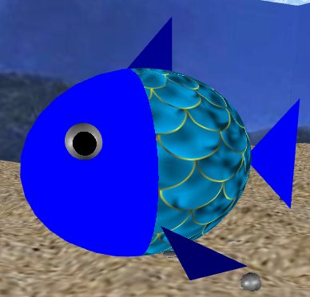
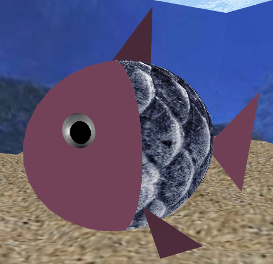
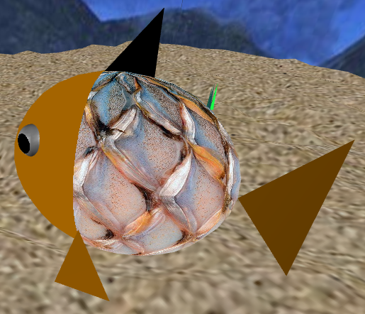
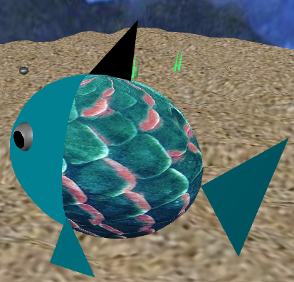
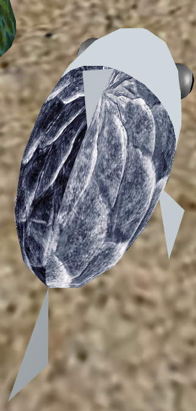

### 2 - MySeaFloor
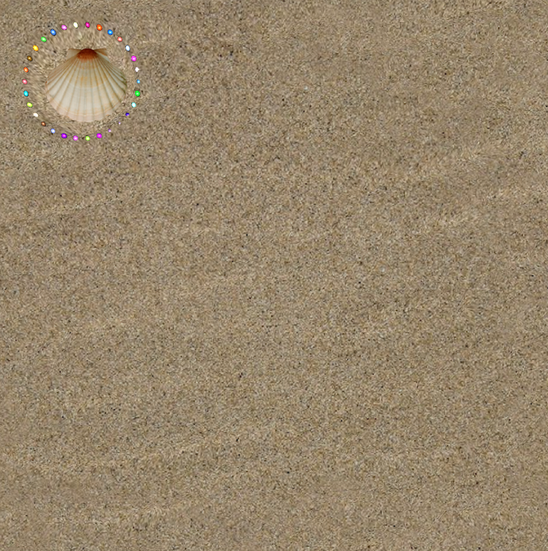
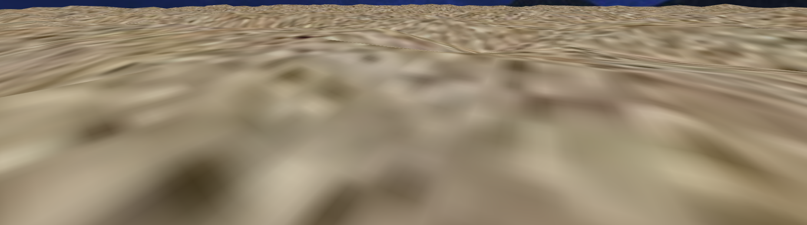
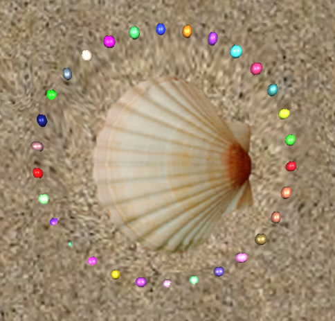

### 3 - Superfície da Água
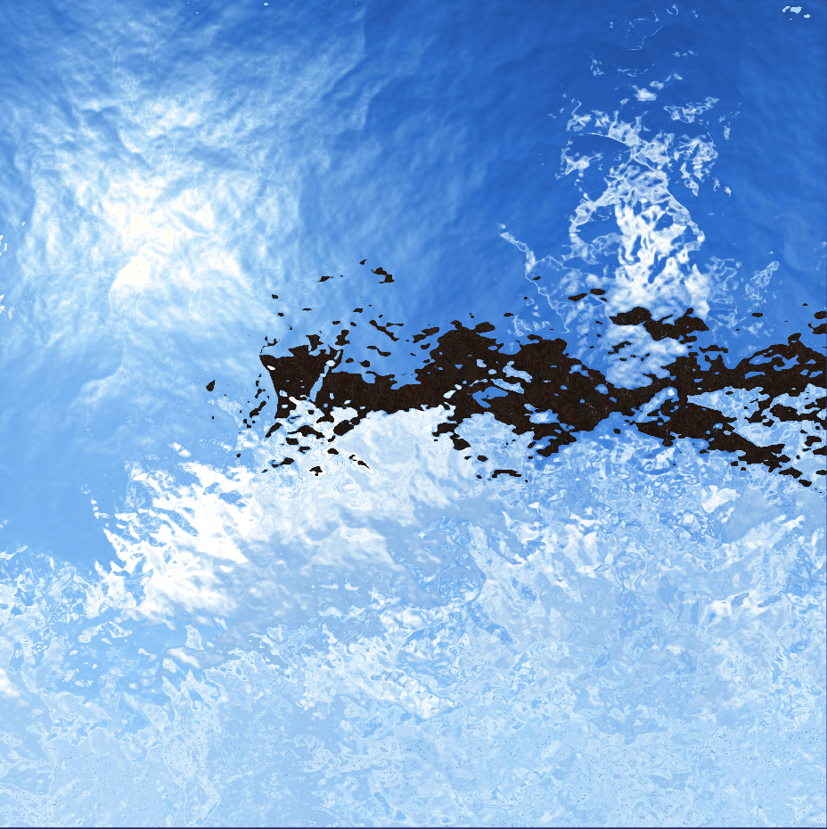
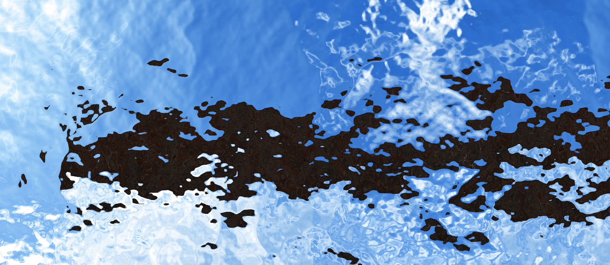

### 4 - MyRock
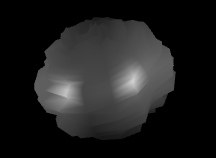
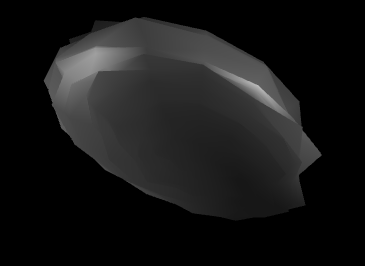
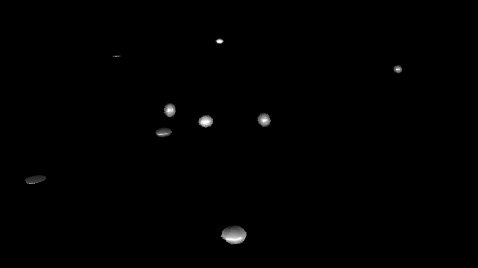
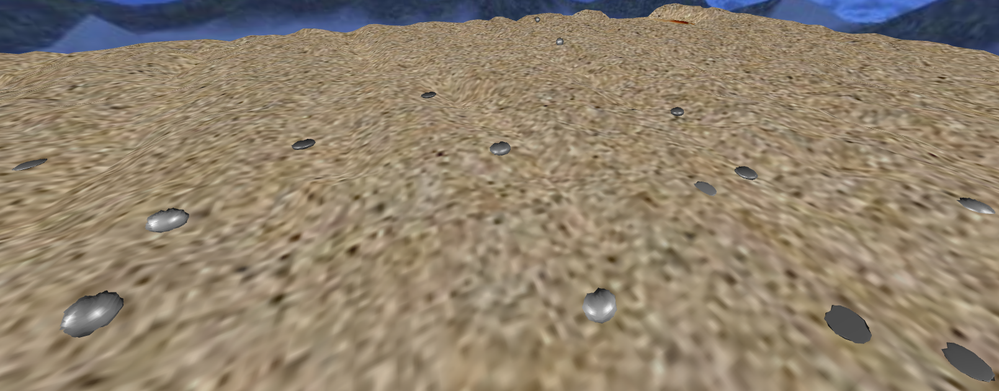

### 5 - MyPillar
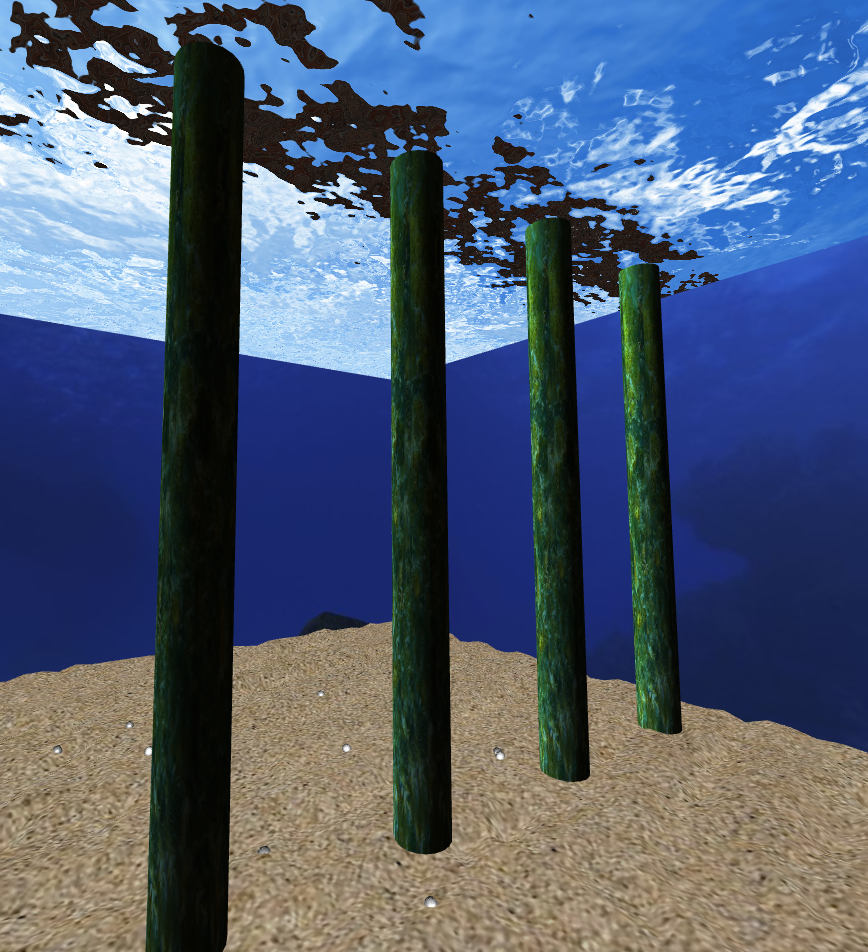
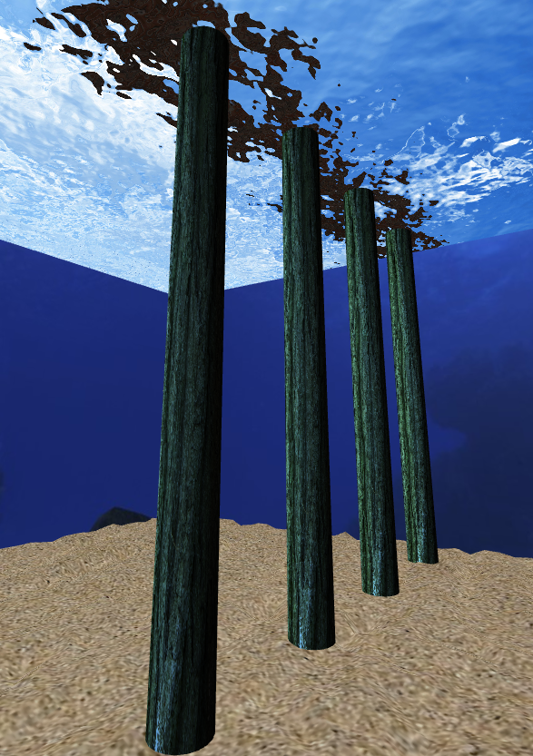
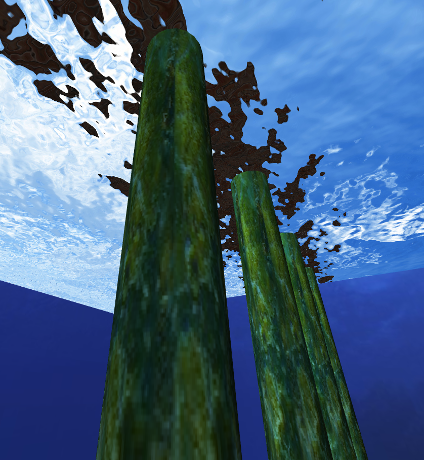
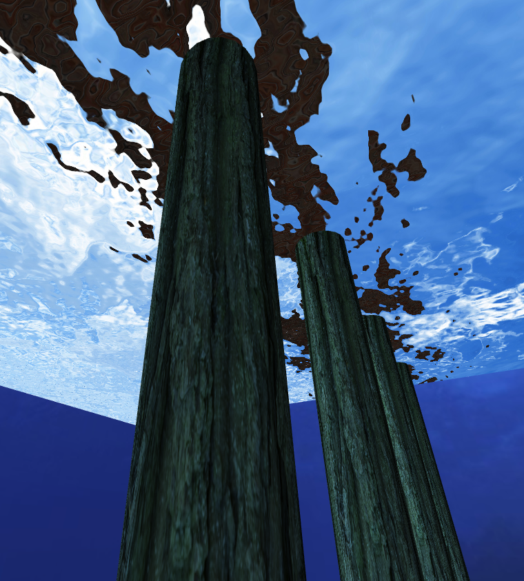

### 6 - Outros elementos
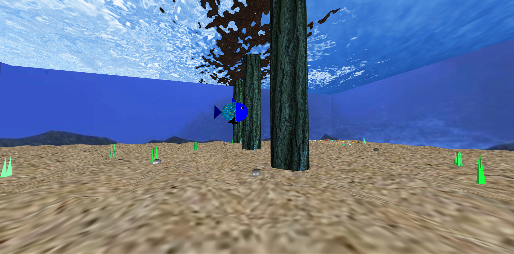

### 7 - Recolha de Pedras
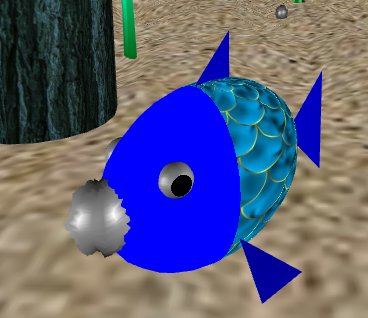
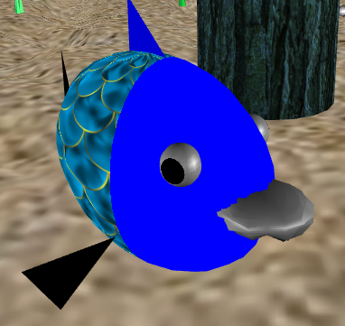
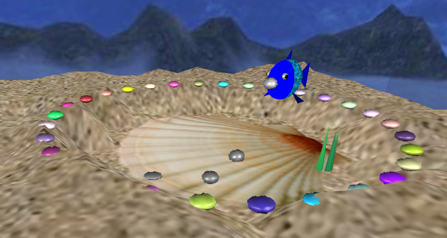

### 8 - Funcionalidades Adicionais
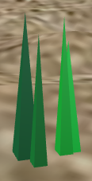
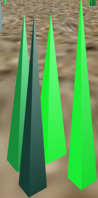
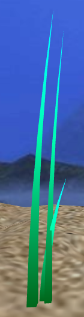
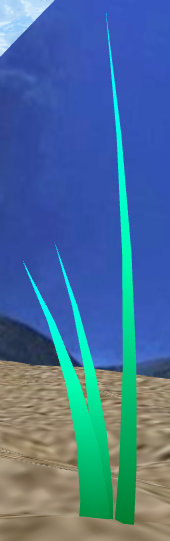
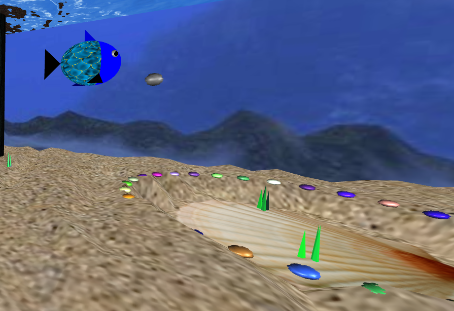
